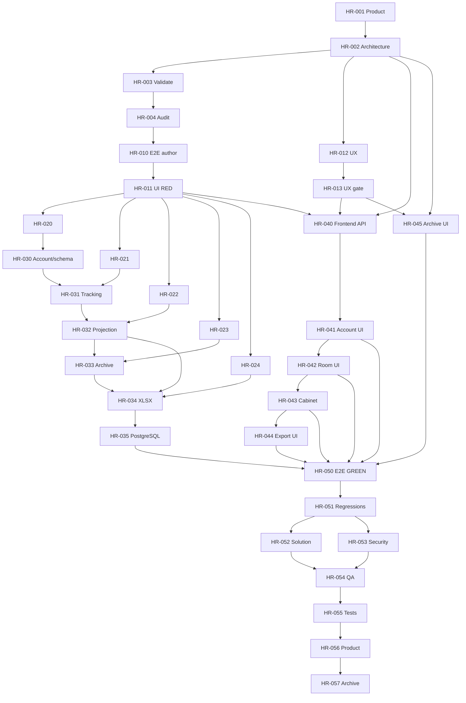

# HR interview cabinet execution plan

## Delivery rule and ownership

The proposal, capability specs, product scope, and architecture are complete. This plan does not alter them. No production code begins until the task audit is ready and HR-011 proves the real browser acceptance red. Each backend production slice also waits for its focused H2 integration RED. Frontend production waits for approved UX artifacts.

| Owner | Exclusive write scope | Deliverable |
|---|---|---|
| Team Lead | `tasks.md`, `execution-plan.md` | Delivery plan |
| Root | `frontend/tests/e2e/hr/e2e-hr-cabinet.mjs`, `frontend/package.json`, orchestration/evidence | Browser RED/GREEN and regressions |
| Backend developer | `backend/**` | Backend code, V9, build descriptors, H2 integration tests |
| Designer (root fallback) | change `ux.md`, `storyboard.html`, `mocks/**` | UX package before frontend |
| Frontend developer | `frontend/src/**` | Frontend production code |
| Auditor/critics/reviewers/QA/Product | review artifacts only | Explicit verdicts |

Agents do not edit another owner's files. No Linear ID was provided; OpenSpec IDs remain planning keys until root links issues. Implementation remains Planned until HR-004 records ready.

## Milestones

### M0 — Ready contract

Deliver HR-001..004. Done when product and architecture remain evidenced complete, strict validation exits 0, and the task audit confirms all ownership and RED dependencies.

### M1 — Acceptance and design foundation

- Browser: HR-010 -> HR-011.
- UX in parallel: HR-012 -> HR-013.
- Backend RED after actual UI RED: HR-020..024, one H2 class per handoff.

Done when the browser failure is caused by missing HR behavior, all focused integration suites are red for expected reasons, and UX Critic approves every normal/error/conflict/archive/accessibility state.

### M2 — Backend delivery

Sequence HR-030 account/schema -> HR-031 tracking -> HR-032 metadata/projection -> HR-033 archive/realtime -> HR-034 XLSX -> HR-035 PostgreSQL proof. Done when each focused suite and the full backend suite pass, the frozen API is honored, and V8-to-V9 plus restart evidence exists.

### M3 — Frontend delivery

Sequence HR-040 typed API -> HR-041 account UI -> HR-042 room controls -> HR-043 cabinet -> HR-044 export; HR-045 implements the frozen terminal archive contract; integrated verification waits for HR-033. Done when every slice passes typecheck/build, matches approved UX, and uses real backend authority without editing root-owned tests/package files.

### M4 — Integrated proof and acceptance

Sequence HR-050 -> HR-051 -> parallel HR-052/053 -> HR-054 -> HR-055 -> HR-056 -> HR-057. Done when browser and regressions are green, all review gates approve, evidence agrees with checkboxes, and strict validation passes immediately before archival.

## Dependency graph



## Isolated runtime and exact commands

Reserved runtime: PostgreSQL database `interview_hr_1788631751397`, backend `http://localhost:18080`, frontend `http://localhost:5173`, reporting timezone `Europe/Moscow`. Root verifies those targets, stores logs/PIDs in a task-specific temporary directory, and does not reuse an unrelated port 8080 process/database.

```bash
npx --yes @fission-ai/openspec@latest validate add-hr-interview-cabinet --strict
SERVER_PORT=18080 DB_URL=jdbc:postgresql://localhost:5432/interview_hr_1788631751397 DB_USER=interview DB_PASSWORD=interview mvn -f backend/pom.xml spring-boot:run
DEV_API_PROXY_TARGET=http://localhost:18080 npm --prefix frontend run dev
E2E_BASE_URL=http://localhost:5173 E2E_API_URL=http://localhost:18080/api npm --prefix frontend run e2e:hr-cabinet
```

Backend tests remain independently runnable on H2:

```bash
mvn -f backend/pom.xml -Dtest=HrAccountProfileIntegrationTest test
mvn -f backend/pom.xml -Dtest=HrRoomTrackingIntegrationTest test
mvn -f backend/pom.xml -Dtest=HrInterviewProjectionIntegrationTest test
mvn -f backend/pom.xml -Dtest=HrRoomArchiveIntegrationTest test
mvn -f backend/pom.xml -Dtest=HrWorkbookIntegrationTest test
mvn -f backend/pom.xml test
```

PostgreSQL proof inspects `flyway_schema_history` at V8, starts the new backend to apply V9, verifies user/room columns and assignment unique/FK/index definitions, restarts the process, and verifies retained authorized archive/detail/export behavior. It also exercises a clean database through V9. The backend developer rechecks migration numbering immediately before creation.

```bash
npm --prefix frontend run typecheck
npm --prefix frontend run build
E2E_BASE_URL=http://localhost:5173 E2E_API_URL=http://localhost:18080/api npm --prefix frontend run e2e:account-binding
E2E_BASE_URL=http://localhost:5173 E2E_API_URL=http://localhost:18080/api npm --prefix frontend run e2e:account-switch
E2E_BASE_URL=http://localhost:5173 E2E_API_URL=http://localhost:18080/api npm --prefix frontend run e2e:roles
E2E_BASE_URL=http://localhost:5173 E2E_API_URL=http://localhost:18080/api npm --prefix frontend run e2e:realtime-auth-recovery
```

RED evidence records command, exit code, assertion, and why the result proves missing behavior. Harness/service/fixture/selector failures do not count. GREEN evidence records command, exit code, artifact/download paths, git state, database, and ports.

## Risk register

| Risk | Delay or failure | Control |
|---|---|---|
| Shared test/package collision | Lost test or script work | Root owns both; frontend writes only `frontend/src/**` |
| UX arrives late | Frontend rework | HR-013 blocks HR-040 onward; root fallback if no designer/critic slot |
| V9 already claimed | Migration conflict | Recheck immediately before HR-030; use next additive number without changing schema |
| H2 masks PostgreSQL behavior | Lock/date defect escapes | HR-035 and HR-050 require the isolated PostgreSQL runtime |
| Retained assignment bypasses revocation | Cross-HR disclosure | Current durable authority in every query plus demotion/reconnect tests and security gate |
| Archive races delayed/realtime writes | Mutated history/retry storm | Shared lock/active guard, cancellation, closeRoom, 410 integration and E2E |
| POI conflict/resource pressure | Failed or partial exports | Pin 5.5.1 in Maven/Gradle; dependency tree, parsed workbook, limits/deadline/semaphores/finally cleanup |
| Broad E2E becomes flaky | Critical-path delay | Deterministic API fixtures, semantic selectors, section diagnostics, no readiness sleeps |
| Legacy completion cannot be reconstructed | Misleading reports | Preserve authoritative/known value; display unknown explicitly |
| Backend rollback reopens archives | Integrity regression | Only compatibility rollback retaining archive guards; additive data remains |

## Handoff

Root records strict validation, then sends the whole plan to Prompt/Task Auditor. After ready: root and Designer execute acceptance/UX in parallel; backend proceeds RED then GREEN by slice; frontend follows approved UX and ready APIs; root runs integrated proof; reviewers, QA, Test Reviewer, and Product Owner close the gates. Backend migration precedes frontend deployment if deployment is later authorized.

## Integration scheduling clarification

Root task audit permits frontend production after HR-011 and approved UX against the frozen HR-002 contracts while backend implementation proceeds independently. PostgreSQL migration proof and backend GREEN gate integrated HR-050, not frontend authoring. File ownership and all test-first gates remain unchanged.
