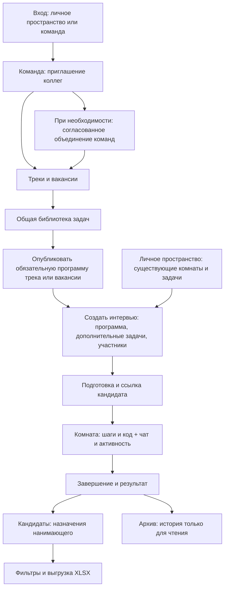

# Командный путь подготовки и проведения интервью

Статус: **согласованный пользовательский путь; реализация запущена пользователем и выполняется по `tasks.md`**. Дата: 9 сентября 2026 года. Редакция 2 — объединение команд, процессы по назначениям, стандартные программы и небольшие экраны.

Это основной документ согласованного продуктового пути. [UX экранов](ux-spec.md) уточняет расположение элементов и состояния; [технический дизайн](design.md) — данные, API, права и миграцию; [формальные требования](specs/) — проверяемое поведение; [план реализации](tasks.md) — порядок исполнимых шагов; [план приёмки](acceptance.md) — сквозные проверки и отрицательные сценарии. При обнаруженном расхождении production-работа соответствующего slice останавливается до уточнения OpenSpec-требований.

## 1. Бизнес-идея

Команда готовит интервью на общей базе знаний, назначает ответственных, проводит встречу в одном рабочем пространстве и передаёт результат нанимающему. Пользователю не приходится каждый раз пересылать задачи коллегам, искать идентификатор нанимающего и вспоминать, где создаётся комната, а где находятся уже проведённые интервью.

Для сотрудника продукт состоит из двух понятных контекстов: **личное пространство** и **команды**. В команде он видит интервью по своим назначениям и общую библиотеку. В личном пространстве сохраняются все разрешённые комнаты, включая участие кандидатом; кандидатский вход не открывает внутренние данные интервью. В команде дополнительно есть сотрудники, треки и вакансии. Профиль содержит настройки человека; рабочие списки находятся в навигации пространства.

**Подтверждено пользователем:** сотрудник может состоять в нескольких командах; принята структура «Команда → Трек → необязательная вакансия»; интервью, кандидатов и результаты видят только назначенные участники. Само членство в команде не открывает эти данные.

В уточнении пользователь подтвердил ещё два решения: процессы сотрудника вычисляются из его назначенных интервью, а программа трека/вакансии содержит обязательную основу с возможностью дополнительных задач. Также в объём добавлено объединение команд и исключена фильтрация задач по трекам. Остальные детали ниже — конкретное предложение для ревью, а не утверждение об уже реализованном поведении.

## 2. Одна история вместо отдельных функций

Анна отвечает за найм в продуктовую команду Atlas. Борис и Вера проводят технические интервью. Вера также помогает команде Orbit: у неё один аккаунт и две команды, между которыми она переключается в интерфейсе. Денис — кандидат, он не становится сотрудником команды после входа в интервью.

### Шаг 1. Анна собирает команду

После входа Анна открывает переключатель пространства и выбирает «Создать команду». Она задаёт название Atlas и становится владельцем команды. Следующий экран предлагает пригласить коллег и создать первый трек. Эти действия можно выполнить позже: интерфейс не требует пройти длинный обязательный мастер настройки.

Анна создаёт отдельную ссылку-приглашение для Бориса и ещё одну для Веры и передаёт их привычным способом. Ссылка приглашает только в команду, не в интервью. Каждый видит название команды, входит в аккаунт или регистрируется и явно нажимает «Вступить». До подтверждения данные команды недоступны. Автоматическая отправка писем не входит в первую реализацию.

Вера принимает приглашение Atlas, оставаясь в Orbit. При переключении пространства заголовок, списки и доступные действия относятся к выбранной команде. Название команды видно и в формах создания. У пользователя не возникает скрытого «текущего работодателя» на уровне аккаунта.

**Результат:** коллеги объединены и видят общий каталог сотрудников и задач, но ещё не видят чужие интервью.

### Шаг 2. Команда определяет контекст найма

В «Треках и вакансиях» Анна создаёт трек Frontend и вакансию «React-разработчик, Middle». Трек группирует профессиональное направление, вакансия — конкретную потребность внутри него. В одном треке можно иметь несколько вакансий; вакансия принадлежит одному треку одной команды.

Если команда проводит общие технические встречи, она выбирает только Frontend, без вакансии. Для быстрого старта предлагается разрешить интервью «Без трека»: это явный вариант формы, а не незаметно потерянные данные. Уточнение этой необязательности выделено в решениях для ревью.

Трек и вакансия — средства организации, а не дополнительные группы доступа. Борис не видит чужих кандидатов только потому, что работает в Frontend. Существующее текстовое поле должности не превращается автоматически в вакансию: старое значение сохраняется как историческая подпись.

**Результат:** интервью сгруппированы по профессиональному контексту без создания отдельной команды для каждой вакансии. Общая библиотека остаётся доступной независимо от треков.

### Шаг 3. Борис готовит общую библиотеку

Борис открывает «Библиотеку задач», создаёт задачу или публикует в Atlas копию своей личной заготовки. Перед публикацией он видит итоговое содержимое и подпись «Будет доступно всем участникам Atlas». Задача хранится в общей библиотеке без тега трека или вакансии. Для удобного повторного выбора Борис собирает именованный набор задач — пресет «Frontend: техническая основа».

Вера открывает библиотеку Atlas и находит задачу по названию/языку или выбирает общий набор «Frontend: техническая основа». Фильтра треков в библиотеке нет; коллегам не нужны код обмена и ручная пересылка. У задачи есть автор, время обновления, область доступа и версия. В личном пространстве исходная заготовка Бориса остаётся личной; публикация копии не меняет её права.

Предлагаемые права: все сотрудники читают библиотеку и создают общие задачи; автор и владелец/администратор команды изменяют и архивируют конкретную задачу; остальные создают копию. Это позволяет пользоваться общей базой без бесконтрольной перезаписи чужого материала. Одновременные правки не затирают друг друга молча.

При добавлении задачи в интервью сохраняется снимок выбранной версии. Если Борис завтра изменит условие в библиотеке, уже подготовленное или проведённое интервью не изменится. Архивирование убирает задачу из прямого выбора в библиотеке, но не уничтожает историю интервью и опубликованные программы с её снимком.

Личные пресеты остаются «Наборами задач» в личной библиотеке. В командной библиотеке теперь тоже есть общие **«Наборы задач»**: именованные упорядоченные списки версий задач, которыми пользуются все сотрудники. Набор — способ переиспользовать подборку; он не выдаёт права на интервью и не заменяет процесс найма.

### Шаг 3а. Анна закрепляет стандарт процесса

На странице Frontend Анна открывает «Программу интервью». Она добавляет набор Бориса и, если нужно, отдельные задачи, проверяет порядок и публикует версию 1. Это обязательная основа интервью трека. На странице вакансии «React-разработчик, Middle» она видит эту основу и добавляет ещё одну обязательную задачу вакансии. Программа вакансии публикуется целиком с явно показанной версией базы Frontend.

При создании интервью этой вакансии система сама подставляет её программу. Интервьюер видит обязательные задания и их версию; он может добавить дополнительные задачи после основы, но не удалить, переписать или переставить обязательную часть. Код решения кандидата, рабочее редактирование кода, оценки и личные заметки продолжают работать по прежним правам: фиксируется исходная программа, а не замораживается редактор.

Если у вакансии нет своей программы, применяется опубликованная основа трека. Если программы нет и у трека, доступен обычный свободный выбор заданий. Настроенный, но ещё не опубликованный или архивированный стандарт не обходится молчаливым созданием интервью без обязательных задач: его нужно опубликовать либо явно изменить настройку уполномоченным управляющим.

Анна меняет стандарт через новую публикацию. Уже созданные комнаты сохраняют прежнюю версию. Опубликованная программа вакансии также сохраняет рассмотренную базу: после изменения трека у неё появляется «Доступна новая основа», и Анна явно обновляет и перепубликовывает программу вакансии. Простое редактирование или архивирование исходной задачи/пресета не меняет действующий стандарт — он хранит свои снимки. Чтобы прекратить использование стандарта, архивируют саму программу.

Одинаковая задача не добавляется в программу дважды, даже через разные наборы; редактор показывает конфликт до публикации. Для интервью по стандарту выбранный трек и вакансия фиксируются при создании. Интервью другого процесса создаётся отдельно: смена подписи не должна оставлять старые задания под новым стандартом.

**Результат:** команда переиспользует подготовленные задания, а конкретное интервью сохраняет свою воспроизводимую программу.

### Шаг 4. Борис готовит интервью Дениса

В разделе «Интервью» Борис нажимает **«Создать интервью»**. В одной форме он видит контекст Atlas, задаёт название встречи, имя кандидата, при необходимости дату и время с часовым поясом, выбирает Frontend и вакансию, проверяет автоматически выбранную стандартную программу и при необходимости добавляет дополнительные задачи или набор.

В блоке «Участники интервью» Борис уже отмечен владельцем комнаты. Он выбирает Веру как интервьюера и Анну как нанимающую из сотрудников Atlas по имени. Рядом с одинаковыми именами отображается различающий идентификатор сотрудника. Не требуется копировать UUID или просить Анну включить глобальный переключатель «Я нанимающий» для командного назначения.

При необходимости Борис добавляет второго нанимающего. Один сотрудник может быть нанимающим в одном интервью и только интервьюером в другом; назначение не переносится на все интервью команды. Для следующего интервью тех же людей можно выбрать снова. Автоматическое назначение всем интервью вакансии и массовые операции в первую версию не входят.

Нанимающий — ответственность за конкретное интервью и его результаты. Внутри комнаты назначение даёт существующие возможности интервьюера, но не делает человека владельцем. У комнаты остаётся один владелец; его специальные действия видны отдельно.

Перед сохранением видно, кто получит доступ. Кнопка «Создать интервью» создаёт запись и возвращает на карточку подготовки; отдельное действие «Создать и открыть комнату» позволяет сразу перейти к встрече. До успешного сохранения никто не назначен, а повторный запрос после сетевой ошибки не должен создавать дубликат.

**Результат:** создано одно интервью с определённым кандидатом, контекстом, зафиксированной версией программы и ответственными. Оно появляется у назначенных сотрудников после загрузки/обновления списка. У остальных сотрудников его нет даже в счётчиках и поиске.

### Шаг 5. Каждый видит свою работу

Борис и Вера находят встречу в «Интервью». Анна также видит её в отдельном рабочем разделе **«Кандидаты»**, поскольку назначена нанимающей. Там название и пояснение прямо говорят: «Кандидаты по вашим интервью. Один кандидат может встречаться несколько раз».

«Интервью» отвечает на вопрос «какие встречи я готовлю, провожу или разбираю?». «Кандидаты» — на вопрос нанимающего «какие кандидаты проходят назначенные мне интервью и с каким результатом?». Оба экрана используют одну запись интервью, а не два независимых списка с разными данными.

Анна может быть назначена в нескольких командах. В первой версии её списки и выгрузка относятся к выбранному пространству; нет неявного объединения данных Atlas и Orbit. В Orbit она увидит только свои назначения Orbit.

В «Участниках» рядом с Верой показываются пары «Frontend · React-разработчик, Middle» и другие процессы её назначенных неархивированных интервью. Это вычисляемые сведения, а не ещё одна роль, которую нужно назначать вручную. Если интервью сменило допустимый контекст, Вера снята с последнего интервью процесса или все такие интервью архивированы, соответствующая отметка исчезает после обновления.

Коллеги видят только названия трека и вакансии — без кандидатов, количества встреч, времени и результатов Веры. Нажатие «Мои интервью в этом процессе» открывает собственные назначения просматривающего сотрудника с выбранным фильтром. Если у него нет участия, показывается понятное пустое состояние; чужие интервью не открываются. Его собственная архивная история по-прежнему доступна через фильтр архива.

Время встречи служит расписанием, а не автоматическим стартом или результатом. Интервью с прошедшей датой и без завершения показывается как «Не завершено», а не как успешно проведённое. Если дата не указана, интерфейс сообщает «Без даты».

Если Вера не может прийти, Борис открывает состав интервью и заменяет интервьюера. Анну или второго нанимающего можно добавить и после создания — через тот же выбор сотрудников. Новое назначение действует после подтверждения сервера; снятый участник теряет соответствующие права и получает понятное уведомление в открытой комнате.

**Результат:** каждый открывает рабочий раздел по своей задаче; ни профиль, ни переключение команды не меняют смысл списков.

### Шаг 6. Команда проводит интервью

Борис открывает комнату и передаёт Денису существующую ссылку кандидата. Вера и Анна входят из своего списка под аккаунтом. Кандидат не получает членство в Atlas, доступ к библиотеке, внутреннему чату, активности или результатам через такую ссылку.

Рабочее место выбирает компоновку по реально доступным ширине **и высоте**. На обычном небольшом ноутбуке основной режим — редактор и одна выбранная вспомогательная область. При достаточном пространстве можно включить расширенный обзор со шагами, редактором, чатом и активностью. «Показать оба» не включается автоматически только потому, что экран широкий: короткое окно тоже может не вместить два читаемых блока.

В небольшом desktop/tablet окне или при увеличенном browser zoom одновременно открыта одна рабочая область. Прямые кнопки ведут к редактору, шагам, условию, моим заметкам, чату и активности. Из шагов чат и активность открываются за одно действие; возврат сохраняет выбранную задачу, курсор и прокрутку. Поле сообщения, ошибка и отправка остаются достижимыми обычной прокруткой и с клавиатуры.

Например, Вера начинает на ноутбуке 1366×768: пишет код и держит рядом активность. Сужает окно или увеличивает масштаб браузера — активность становится отдельной областью, но выбранный шаг и редактор сохраняются. На tablet 768×1024 она читает сообщение, отвечает, открывает активность и возвращается к коду без повторного выбора задачи. Точные режимы и проверяемые минимумы заданы в UX-08; базовое общение и наблюдение не требуют большого монитора.

Название «Активность кандидата» объясняет содержание бывших «Логов»: действия в редакторе и события кандидата. Это история действий, а не вывод выполнения программы; добавление исполнения кода или новой консоли в этот объём не входит. Внутренний чат содержит явную подпись «Видят только участники со стороны команды, назначенные на интервью». Это не общий чат с кандидатом.

Вера читает активность, Борис обсуждает наблюдение с Анной в чате. На широком рабочем месте эти блоки могут быть видны одновременно; на маленьком они открываются напрямую с сохранением общего контекста. Чтение истории и переключение панелей не меняют активный шаг у кандидата. Локальный выбор шага интервьюером сохраняется; смена шага для кандидата остаётся отдельным явным действием с текущими проверками прав. Переход из события к шагу не добавляется: текущая история не гарантирует такую связь.

Новые сообщения помечаются счётчиком, но не перехватывают фокус. При чтении истории прокрутка не прыгает в конец. Черновик сообщения сохраняется при переключении вкладки и шага. Личные заметки интервьюера остаются личными и не превращаются в командный чат.

**Результат:** общение и наблюдение сопровождают интервью, а не требуют постоянно покидать шаги.

### Шаг 7. Нанимающий получает результат

Уполномоченный участник завершает интервью через действующие действия комнаты и сохраняет имеющиеся оценки/вердикт. Анна открывает результат из «Кандидатов»: видит кандидата, трек и вакансию, дату, текущий вердикт, комментарий и оценки задач. Итог не вычисляется автоматически по активности кандидата; личные заметки других интервьюеров не раскрываются.

Если Денис проходит ещё одну встречу, создаётся второе интервью. Система не объединяет двух Денисов по имени и не изображает полноценную ATS с этапами найма. Это ограничение первой версии видно в интерфейсе и экспорте.

Анна фильтрует назначенные ей интервью Atlas по треку, вакансии, состоянию и периоду и выгружает `.xlsx`. Перед действием видны пространство и область: «Ваши назначения · Atlas · Frontend». Выгрузка содержит все подходящие записи, а не только текущую страницу, и использует те же фильтры и правила даты. Нулевой результат не подменяется данными всей команды.

Если владельцу больше не нужна комната, он архивирует командное интервью. Оно доступно назначенным действующим сотрудникам для чтения и экспорта; снова запускать редактор и менять результат нельзя. Исправление результата допускается до архивирования по прежним полномочиям.

**Результат:** нанимающий получает проверяемую историю назначенных интервью без ручного сбора ссылок и таблиц.

### Шаг 8. Процесс продолжает работать при изменениях команды

Вера перестаёт работать в Atlas. Удаление её членства закрывает каталог, библиотеку, интервью, внутренние данные и выгрузки Atlas, в том числе в уже открытых вкладках. Данные Orbit и личного пространства остаются доступны по их собственным правам.

При плановом выходе Вера сначала передаёт свои неархивированные интервью другому действующему сотруднику. Для срочного прекращения доступа есть «Приостановить участие»: оно действует немедленно и не требует сотрудничества Веры. Её неархивированные интервью временно приостанавливаются; остальные назначенные сотрудники сохраняют разрешённое чтение, но live-изменения закрыты.

Владелец команды может предложить принять такую комнату одному из уже назначенных действующих интервьюеров или нанимающих. Новый владелец явно принимает ответственность. Организатор восстановления видит технический идентификатор комнаты, прежнего владельца и состояние передачи, без имени кандидата и результатов. Он не может назначить себе доступ, если раньше не был назначенным участником. Если подходящего участника нет, интервью остаётся приостановленным; допускается его архивирование без просмотра содержимого. Передача постороннему сотруднику для обхода этой границы не предусмотрена.

Повторное вступление Веры в Atlas само по себе не возвращает прежние назначения. Её задачи остаются в командной библиотеке с авторством; администратор может продолжить их сопровождение. Команда сохраняет подготовленные материалы без сохранения доступа бывшего сотрудника к кандидатам.

### Шаг 9. Отдельные команды становятся одной

Позже Atlas, где собеседуют Frontend, и отдельная команда Backend начинают нанимать вместе. Анна открывает «Настройки команды → Объединить команды», выбирает существующую команду назначения и предлагает итоговое название «Engineering». Объединение сохраняет одну из существующих команд как рабочее пространство; это реальное объединение сотрудников и материалов, а не папка над двумя независимыми командами.

Если Анна не состоит в Backend, она использует точный ID, полученный от её владельца. Глобального каталога чужих команд нет. Владельцу Backend приходит запрос на согласование внутри платформы; переход к просмотру плана не означает окончательного согласия на объединение. Оба владельца проверяют один и тот же итог: сотрудники без дублей, единственный владелец результата, административные роли, названия треков/вакансий/наборов и общая библиотека.

По умолчанию владелец выбранной команды назначения остаётся владельцем, её роли сохраняются, а управляющие присоединяемой команды становятся обычными участниками, если иной итог явно не внесён в одобренный план. Если человек активен в одной команде, но вышел, был исключён или приостановлен в другой, конфликт нельзя разрешить автоматическим восстановлением. Нужное решение принимается через обычное управление участием, затем формируется свежий план.

Совпадающие названия треков и наборов явно переименовываются: система не объединяет разные задачи или вакансии по похожему имени. Старые программы и их версии сохраняются. Общая библиотека становится доступна объединённому составу — владельцы видят это последствие до подтверждения. **Доступ к кандидатам не расширяется:** каждый сотрудник сохраняет только действующие назначения на конкретные интервью; прежние отозванные права не возвращаются.

Оба текущих владельца подтверждают одну версию плана. Перед выполнением сервер повторяет проверки состава, ролей и данных. Объединение не выполняется при активных сессиях интервью и незавершённых передачах владельцев; интерфейс объясняет, что нужно завершить текущую работу и повторить проверку, не раскрывая чужих кандидатов. Пока операция не завершилась успешно, пользователь не видит частично объединённую команду.

После успеха есть одно пространство Engineering. Вера, состоявшая в обеих командах, отображается один раз. Интервью, задачи, треки, вакансии, программы и ссылки комнат сохраняют свои идентификаторы и историю. Присоединённая команда больше не работает отдельно; её старая ссылка ведёт в итоговую команду только после проверки актуального доступа. Неиспользованные приглашения обеих команд отзываются согласно согласованному плану, новые создаются уже из Engineering.

Ошибка до фиксации оставляет команды раздельными. Успешное объединение не имеет автоматической кнопки «Разделить обратно»: владельцы заранее видят последствия. Обычный перенос отдельных интервью между независимыми командами по-прежнему не входит в объём; исключение предусмотрено именно для подтверждённого объединения целиком.

## 3. Карта пути

Личный путь сохраняет собственные правила доступа и выбора нанимающего; схема показывает общий рабочий цикл, а не автоматический перенос личной комнаты в команду.

## 4. Термины и границы

| Понятие | Что означает | Чего само по себе не даёт |
|---|---|---|
| Аккаунт | Один человек на платформе | Роль в чужой комнате |
| Команда | Каталог коллег и общие материалы | Чтение всех кандидатов команды |
| Владелец/администратор команды | Управляет составом, треками, библиотекой | Власть владельца комнаты, чтение чужих результатов |
| Трек | Направление внутри одной команды | Новую роль доступа |
| Вакансия | Конкретная позиция одного трека | Автоматическое назначение нанимающего |
| Набор задач / пресет | Общая упорядоченная подборка версий заданий | Доступ к интервью и ручную принадлежность сотрудника процессу |
| Программа процесса | Опубликованный обязательный стандарт трека/вакансии | Изменение ранее созданных интервью при новой публикации |
| Процессы сотрудника | Пары трек/вакансия по его действующим назначениям | Доступ коллег к его кандидатам |
| Интервью | Запись встречи и связанная с ней комната | Объединённый профиль кандидата за все встречи |
| Владелец комнаты | Один ответственный с существующими специальными действиями | Доступ к чужим личным заметкам |
| Интервьюер | Назначенный сотрудник, проводящий интервью | Права владельца комнаты |
| Нанимающий | Назначенный на интервью получатель результата; внутри комнаты имеет права интервьюера | Глобальный доступ ко всем интервью |
| Кандидат | Участник по правилам входа кандидата | Членство в команде и её внутренние данные |

## 5. Решения по семи исходным потребностям

| Потребность | Решение в едином пути | Где проверять |
|---|---|---|
| Объединить сотрудников, включая несколько команд | Переключатель пространства, независимое членство, каталог сотрудников | Шаги 1 и 8 |
| Назначать одного или нескольких нанимающих | Выбор сотрудников по имени при подготовке и в карточке интервью | Шаг 4 |
| Разделить направления/треки/вакансии | Команда → трек → необязательная вакансия; фильтры | Шаги 2, 5, 7 |
| Делиться задачами внутри команды | Общая библиотека, явная публикация личной копии, снимки версий | Шаг 3 |
| Исправить доступ к чату и логам | Независимая панель общения и активности, два блока рядом на широком экране | Шаг 6 |
| Сделать профиль интуитивным | Настройки аккаунта отдельно; рабочая навигация всегда в одном месте | UX-01–UX-03 в UX-спецификации |
| Убрать разделение комнат | Один список «Интервью» и видимая кнопка «Создать интервью» | Шаги 4–5 |

## 6. Предложения, которые особенно важно проверить

Подтверждены закрытость интервью по назначениям, иерархия треков/вакансий, производные процессы сотрудников и обязательная основа программы с дополнительными задачами. Объединение команд и отсутствие фильтра задач по трекам прямо запрошены пользователем. Ниже перечислены выбранные в этой редакции значения по умолчанию; они позволяют прочитать цельный путь, а не блокируют подготовку документа вопросами.

| Решение для ревью | Предложение | Причина |
|---|---|---|
| Название общего раздела | «Интервью», внутри — вход в комнату | Пользователь приходит провести встречу; техническое понятие комнаты остаётся внутри |
| Трек при создании | Необязателен, есть явное «Без трека» | Быстрый старт и совместимость с простыми встречами |
| Кто может быть нанимающим | Любой действующий сотрудник выбранной команды | Ответственность относится к интервью; глобальный флаг остаётся для личного старого сценария |
| Кто изменяет общую задачу | Автор и администраторы; остальные копируют | Общая доступность не требует произвольного изменения чужих заданий |
| Кто закрепляет стандарт процесса | Владелец/администратор команды публикует программу; интервьюеры добавляют задания после основы | Стандарт един для процесса, подготовка конкретной встречи остаётся гибкой |
| Какие процессы показаны у сотрудника | По действующим назначениям на неархивированные интервью, включая завершённые | Карточка остаётся актуальной; собственная архивная история доступна отдельно |
| Чат | Существующий внутренний чат интервьюеров | Чат с кандидатом — отдельный сценарий, не подразумевается переименованием |
| Нанимающий в нескольких командах | Переключает пространство; выгрузка отдельно по команде | Область данных всегда явна; общий межкомандный экран можно добавить позже |
| Приглашение сотрудника | Отдельная одноразовая ссылка, срок 7 дней | Работает без нового сервиса доставки писем; можно отозвать и перевыпустить |
| Срочный уход владельца интервью | Приостановление доступа; передача уже назначенному сотруднику с его согласием | Отзыв доступа не зависит от сотрудничества уходящего, администратор не получает кандидатов |
| Объединение команд | Две команды в одну выбранную существующую, по согласованному обоими владельцами плану | Общий состав и материалы при сохранении назначений интервью |
| Отдельный перенос интервью | Не входит; исключение — объединение команд целиком | Не создаёт обход процесса объединения и проверки прав |

## 7. Что считается завершённым пользовательским путём

Один проверочный сценарий проходит от создания Atlas и приглашения Веры до интервью Дениса и выгрузки результата Анной. Вера может повторить часть действий в Orbit без смешивания данных. Другой сотрудник Atlas не получает данные Дениса из списков, счётчиков, URL, выгрузок или уже открытого соединения после отзыва доступа. Кандидат видит только свою сторону комнаты.

Компоновка проверяется не только на большом мониторе, но и на ноутбуках 1366×768/1280×720, окнах 1024×600/768 и tablet 768×1024, включая 125/150/200% browser zoom. Два или несколько блоков допускаются только при достаточных размерах; в компактном desktop/tablet режиме сохраняются прямые переходы, keyboard-only navigation, видимый focus и полезная область ввода без общего horizontal overflow. При объединении команд число видимых кандидатов не расширяется автоматически, а программа сохраняет обязательный состав. В рабочих разделах навигация не прыгает при включении роли нанимающего. Уже созданные личные комнаты и задания доступны после обновления через новое меню.

Подробные критерии, отрицательные сценарии и требуемые тесты находятся в требованиях и плане реализации. Документальный этап завершён; текущий объём включает тест-first реализацию, проверку и локальный запуск проекта для пользователя. Change не архивируется как выполненная функциональность до завершения задач и итоговой приёмки.
