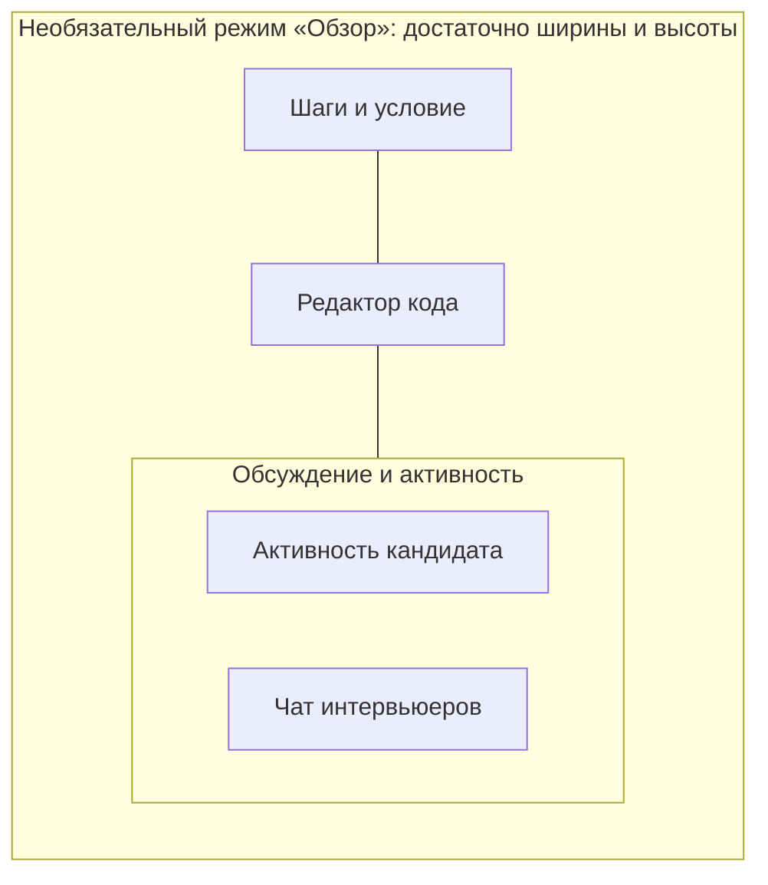

# UX-спецификация командного интервью

Статус: проект поведения для ревью. Здесь заданы экраны и взаимодействия, а не реализованный интерфейс или утверждённые визуальные макеты. Связанный основной документ — [пользовательский путь](user-journey.md).

## Исследование текущего решения

Исследование выполнено по исходникам и OpenSpec, без запуска интерфейса и без пользовательского usability-теста. Выводы о расположении основаны на структуре компонентов. Перед реализацией дизайнер проверяет предложенную компоновку на интерактивном прототипе с длинным содержимым и масштабированием.

| Наблюдение в текущем коде | Источник | Следствие для нового UX |
|---|---|---|
| «Комнаты» содержит только создание; «Управление комнатами» — существующие комнаты | `frontend/src/pages/dashboard/dashboardConstants.ts`, `CreateRoomSection.tsx`, `ManageRoomsSection.tsx` | Один раздел «Интервью»: список плюс создание |
| Карточка профиля и три метрики стоят выше рабочей навигации; в HR-разделе скрываются | `frontend/src/pages/DashboardPage.tsx` | Общая навигация на постоянном месте; профиль отдельно |
| Настройка «Я нанимающий» и копируемый UUID находятся в карточке профиля | `frontend/src/pages/dashboard/HrProfileSection.tsx` | Сохранить личные настройки в профиле, командные назначения выполнять в интервью |
| «Кандидаты и интервью» — строки по roomId; фильтрация по датам МСК | `frontend/src/pages/dashboard/HrCabinetSection.tsx` | Не обещать единый профиль человека; сохранить явный источник даты |
| Банк задач передаёт сериализованное содержимое через clipboard; пресеты — личные наборы | `frontend/src/pages/DashboardPage.tsx`, `PresetsSection.tsx` | Командная библиотека заменяет пересылку внутри команды; личные наборы сохраняются |
| `activeRailPanel` выбирает только tasks/roomTools; `roomToolsTab` — только notes/logs | `frontend/src/pages/RoomPage.tsx` | Разделить навигацию шагов и вспомогательную панель |
| Чат — сообщения интервьюеров; privateNotes — отдельные личные заметки | `frontend/src/pages/RoomPage.tsx` | Не смешивать три аудитории: кандидат, назначенные интервьюеры, автор личной заметки |
| История активности загружается при открытых логах; новая запись чата прокручивает вниз | `frontend/src/pages/RoomPage.tsx` | Задать загрузку видимой панели и чтение истории без скачков |

Существующие активные changes по непубликуемым шагам, группировке активности, SSE и терминологии сверяются перед реализацией. Редизайн не откатывает уже работающий manager workspace.

## UX-01. Общая навигация и контекст

На desktop слева располагается постоянная навигация пространства, сверху в ней — переключатель с видимым названием команды либо «Личное пространство». Внизу навигации — меню аккаунта с именем, «Профиль» и «Выйти». Заголовок страницы и основное действие находятся над содержимым на постоянной высоте относительно страницы. Личные метрики не вставляются между навигацией и контентом.

| Командное пространство | Назначение | Видимость |
|---|---|---|
| Интервью | Подготовка, проведение, результаты доступных встреч | Все действующие сотрудники; данные только по назначениям |
| Кандидаты | Представление интервью нанимающего и выгрузка | Сотрудники с действующим назначением нанимающего; прямой пустой маршрут показывает объяснение без чужих данных |
| Библиотека задач | Общие задания и переиспользуемые наборы задач | Все действующие сотрудники |
| Треки и вакансии | Процессы найма и собственные интервью в каждом процессе | Все читают; владелец/администратор изменяют структуру |
| Участники | Состав команды и процессы сотрудника по назначениям на интервью | Все читают минимальный каталог; управление составом только у уполномоченных |
| Настройки команды | Название, роли, восстановление приостановленных интервью, объединение команд | Владелец/администратор по матрице прав; объединение подтверждают владельцы обеих команд |

Новые рабочие маршруты используют `/workspace/personal/...` и `/workspace/teams/:teamId/...`; профиль — `/profile`.

| Старый маршрут | Новый вход | Совместимость |
|---|---|---|
| `/dashboard` | `/workspace/personal/interviews` | Открывает личный список |
| `/dashboard/rooms` | `/workspace/personal/interviews/new` | Сохраняет старый смысл ссылки на создание |
| `/dashboard/manage` | `/workspace/personal/interviews` | Существующие личные комнаты |
| `/dashboard/tasks` | `/workspace/personal/library` | Поддерживаемые параметры фильтра языка сохраняются |
| `/dashboard/presets` | `/workspace/personal/library?tab=sets` | Личные «Наборы задач» |
| `/dashboard/hr` | `/workspace/personal/candidates` | Только личный scope и текущий isHr |
| `/dashboard/admin`, `/dashboard/agents` | Существующие служебные экраны | Старые условия прав/флага |
| `/room/:inviteCode` | Тот же путь | Ссылка и правила роли не меняются |

Redirect не запускает создание, публикацию или назначение. Чувствительные tokens не добавляются в новые query-параметры/историю навигации.

В личном пространстве остаются «Интервью», «Библиотека задач» и «Кандидаты» при включённой личной функции нанимающего. Личные «Пресеты» становятся вкладкой **«Наборы задач»** внутри личной библиотеки; их CRUD и выбор при создании сохраняются. В команде библиотека также содержит вкладки **«Задачи»** и **«Наборы задач»**. Набор — общая переиспользуемая подборка; принадлежности к треку/вакансии у него нет. **Программа интервью** настраивается у конкретного трека/вакансии по UX-12 и задаёт обязательную базу задач. Обычный личный или командный набор не становится обязательной программой автоматически.

Существующие «Админка» и включаемые флагом «Агент-операции» сохраняют условия доступа и отдельный служебный вход. Роль администратора аккаунтов не изображается ролью администратора команды.

При смене пространства сохраняется тип открытого списка, если он доступен; иначе открываются «Интервью». Фильтры и выделение сбрасываются на значения выбранного пространства, чужие строки не показываются даже временно. Возврат назад восстанавливает URL/контекст, но заново проверяет права. Название команды не является идентификатором: две одноимённые команды различаются подписью владельца или коротким ID.

На узком экране навигация открывается отдельным меню с той же структурой. Аватар не становится единственным неочевидным входом к рабочим спискам. Клавиатурный фокус, активный раздел и доступные имена кнопок обязательны.

## UX-02. Первый вход, команды и приглашения

**Без команд:** личные комнаты и задачи доступны сразу; переключатель предлагает «Создать команду» и объясняет, что в существующую вступают по приглашению. Создание команды — название 1–100 символов после trim, без требования настроить вакансии заранее.

**После создания:** компактный блок начала работы с двумя действиями «Пригласить коллег» и «Создать трек». После пропуска он остаётся доступен из пустых состояний соответствующих разделов, не перекрывает рабочий список.

**Приглашение:** уполномоченный сотрудник создаёт ссылку для одного вступления, видит срок 7 дней и кнопку копирования. Каждая новая ссылка — отдельное приглашение; несколько ссылок допустимы. В списке приглашений видны только состояние, время создания/истечения, создатель и действие отзыва. Публичная ссылка не раскрывает состав команды и кандидатов.

**Принимающий:** страница показывает название команды, срок и текст «Вы вступаете как участник». Неавторизованный проходит вход/регистрацию и возвращается к тому же приглашению. Авторизованный видит текущий аккаунт и возможность сменить его до принятия. Вступление выполняется только явной кнопкой. Повторное принятие тем же человеком показывает «Вы уже в команде», другим — «Приглашение недоступно».

**Неактуальная ссылка:** отдельное состояние «Приглашение истекло или отозвано», возможность вернуться в свои пространства. Ошибка сети содержит «Повторить», не называется истечением. UI никогда не объявляет членство до серверного подтверждения.

**Удаление/выход:** подтверждение называет только выбранную команду и потерю доступа к её материалам и интервью. Последний владелец сначала передаёт владение командой. При плановом выходе сотрудник с неархивированными комнатами во владении сначала передаёт каждую из них. Отдельное действие администратора «Приостановить участие» немедленно отзывает доступ, даже если передача не выполнена; owned-интервью получают состояние «Приостановлено: требуется владелец». Владелец команды видит очередь таких комнат по техническому ID и прежнему владельцу, без кандидатов/результатов, и может предложить передачу уже назначенному действующему менеджеру. Тот принимает её явно. Пока подходящего человека нет, комната остаётся только для чтения; владелец команды может архивировать её без просмотра. Обычное членство и восстановление участия не возвращают старые назначения. Вход в очередь — «Настройки команды → Интервью без владельца». Уже назначенный получатель видит предложение передачи в своей доступной карточке приостановленного интервью с действиями «Принять» и «Отказаться». Инициатор может отменить предложение; при pending действие заблокировано, устаревшее предложение просит обновить данные. После принятия новый владелец отдельно нажимает «Возобновить интервью». Внешние уведомления и автоматическая отправка писем не требуются.

## UX-03. Профиль

Профиль открывается из меню аккаунта как самостоятельный экран. В нём находятся имя и существующие настройки аккаунта, личная настройка «Я нанимающий», стабильный ID для личных приглашений и выход из аккаунта. Состав конкретной команды изменяется в «Участниках», не в профиле.

Под настройкой нанимающего: «Для личных интервью. В команде вас назначают на конкретное интервью». Переключатель не управляет командными назначениями и не создаёт ощущение, что его выключение отзывает доступ в комнате. Кандидаты, комнаты и рабочие метрики не вставляются под настройками как нижние вкладки.

После сохранения показывается результат, при ошибке сохраняются введённые данные. Возврат в предыдущее пространство сохраняет его идентичность и заново проверяет доступ. Пропажа личного раздела нанимающего после выключения функции приводит к доступному списку интервью, а не к пустому экрану.

## UX-04. Треки и вакансии

Экран содержит список треков и вложенные вакансии с количеством **доступных текущему сотруднику интервью**, если счётчик вообще показывается. Число всех кандидатов команды не выводится. Действия создания и редактирования доступны владельцу/администратору; всем остальным доступен просмотр и фильтрация своей работы.

Нажатие на трек или вакансию открывает страницу процесса с названием команды и точным контекстом. В ней список **«Мои интервью в этом процессе»** использует текущие назначения смотрящего сотрудника и те же строки/действия, что «Интервью». Для трека список включает разрешённые встречи этого трека с вакансиями и без них; для вакансии — только её встречи. Подразделы и переключатели не расширяют доступ. Пустое состояние говорит «У вас нет доступных интервью в этом процессе» и предлагает разрешённое создание, а не утверждает, что вся команда не проводит интервью. Архив доступен через явный фильтр истории, результаты — по прежним назначениям.

В форме интервью выбор вакансии ограничен выбранным треком. При смене трека неподходящая вакансия сбрасывается с явным сообщением. Выбор «Без трека» очищает вакансию. При создании из страницы вакансии её контекст предзаполнен и виден перед сохранением.

Для трека и вакансии задаются имя 1–100 символов, активное/архивное состояние и необязательное описание до 2000 символов. Переименование не меняет идентификатор. В карточке уже созданного интервью отображается сохранённая подпись контекста; рядом при необходимости объяснение, что справочник позже изменён.

В карточке процесса есть отдельный раздел «Программа интервью»: действующая опубликованная версия, статус черновика либо «Программа не настроена». Чтение программы доступно сотрудникам команды; создание и публикация — владельцу/администратору, как управление самим процессом. Кнопка создания интервью использует эффективную программу этого процесса по UX-12, а не предлагает выбрать произвольный альтернативный стандарт.

Архивирование объясняет, что новые привязки недоступны, а история сохраняется. Архивировать трек с активными вакансиями нельзя: сначала нужно архивировать вакансии; форма показывает понятный список вакансий, не раскрывая интервью. Архивированные значения доступны в исторических фильтрах и отмечены «В архиве». Дубликат имени внутри одного уровня отклоняется без сброса формы; регистр/краевые пробелы не создают новый вариант.

## UX-05. Библиотека задач

На вкладке «Задачи» находятся поиск по названию, фильтр языка, переключатель «Действующие / Архив» и кнопка «Создать задачу». Элемент списка: название, язык, автор, версия, время обновления; действие «Просмотреть» доступно всем сотрудникам. У отдельной задачи нет принадлежности к треку/вакансии и фильтра по треку: один материал можно использовать в разных процессах через программы и конкретные интервью. Контекст процесса выбирается у программы и интервью, а не создаётся у задач автоматически.

Создание общей задачи сразу происходит в указанной команде, с явной подписью области доступа. Личный черновик можно подготовить в личной библиотеке и затем выбрать «Опубликовать копию в команду». Открывается проверка содержимого и выбор доступной команды; по умолчанию ничего не публикуется. Автоматического копирования всего личного банка нет.

Просмотр: условие, стартовый код, язык и происхождение; действия по правам «Редактировать», «Создать копию», «Архивировать». Неавтору без административных прав доступна копия, не перезапись. Копия общей задачи создаётся только в той же команде; обычного действия переноса в личное пространство или другую команду нет. Согласованное объединение команд переносит библиотеку целиком по отдельному процессу UX-13 и не является скрытым вариантом этой кнопки.

В форме редактирования версия сохраняется при открытии. Если другой автор сохранил изменения, UI показывает конфликт и предлагает открыть актуальную версию, сохранив локальный текст для ручного сравнения. Нет молчаливого «последняя запись победила». Архивирование подтверждается с пояснением о сохранении задач в существующих интервью. В архивном просмотре автор и администратор могут выбрать «Восстановить»: создаётся новая актуальная версия, после подтверждения задача возвращается в выбор.

При свободном выборе задач или добавлении дополнительных заданий пользователь видит командную библиотеку, отмечает несколько задач, просматривает условие и задаёт порядок. На итоговом экране указаны название и версия каждой задачи. Изменившаяся/архивированная библиотечная задача при сохранении нового выбора вызывает адресную ошибку с возможностью пересмотреть выбор; остальные поля формы сохраняются. UI не подменяет выбранную версию автоматически. Уже опубликованная программа использует собственные зафиксированные снимки по UX-12: последующий архив её библиотечного источника не делает программу непригодной.

Пустые состояния различаются: «В библиотеке пока нет задач» с разрешённым созданием; «По вашим фильтрам ничего не найдено» со сбросом фильтра; ошибка загрузки с повтором. Кнопки изменения отсутствуют у потерявшего доступ пользователя, а открытое содержимое очищается.

Вкладка **«Наборы задач»** содержит именованные упорядоченные подборки общих задач: название, автор, число задач и действие просмотра. Все действующие сотрудники команды читают и используют наборы без передачи кода; создавать может сотрудник, изменять/архивировать — автор и управляющие библиотекой. При использовании в конструкторе программы набор раскрывается в упорядоченные задачи с источником, а не остаётся «живой» ссылкой, которая незаметно меняет опубликованную программу. Устаревшая/архивированная задача в наборе отмечена адресно; до публикации нужно исправить состав. Наборы не получают собственных треков или фильтра процессов.

## UX-06. Единый список интервью

Основное действие — **«+ Создать интервью»**, где плюс дополняет текст, а не заменяет его. Пустой список предлагает то же действие. Поле поиска, фильтры трека/вакансии/состояния и кнопка обновления располагаются над списком, а не в профиле.

Строка командного интервью содержит название, кандидата либо «Не указан», трек/вакансию либо явное отсутствие, дату с часовым поясом либо «Без даты», состояние и роль текущего человека. Архив находится в отдельном фильтре и не смешивается с предстоящими встречами. Меню строки показывает разрешённые операции; отсутствие прав объясняется там, где действие иначе было бы ожидаемо.

| Состояние | Признак | Основное действие |
|---|---|---|
| Запланировано | Не завершено, не архив, дата в будущем | «Открыть подготовку» / «Войти в комнату» |
| Не завершено | Не завершено, не архив, дата наступила или отсутствует | «Войти в комнату» |
| Завершено | Есть фактический finished state | «Посмотреть результат» |
| В архиве | Есть archive state, независимо от расписания | «Посмотреть результат», только чтение |
| Приостановлено | Владелец отключён от команды | Разрешённый просмотр, уведомление о передаче; вход в live-комнату закрыт |

Показатель «Идёт сейчас» не добавляется по одному лишь времени в расписании. Индикатор подключённых людей, если сохраняется, описывает присутствие, а не бизнес-статус встречи.

Личный список сохраняет существующие комнаты, где человек владелец, интервьюер **или кандидат**. Для кандидата видна его роль и только разрешённые исходными правилами поля/вход; внутренние данные нанимающего не добавляются. Кандидат по ссылке командной комнаты тоже не превращается в сотрудника: прямой вход остаётся самостоятельным путём, без страницы команды и её каталога.

Созданное интервью имеет карточку подготовки с составом, задачами, контекстом и разрешёнными действиями «Войти в комнату» / «Скопировать ссылку кандидата». Это та же запись, а не дополнительная сущность. Существующие действия переименования/удаления личной комнаты и owner-only ограничения сохраняются; для командного интервью удаление заменено архивированием.

## UX-07. Создание и изменение интервью

Одна полноразмерная форма с последовательными блоками; не длинный мастер с обязательными переходами:

1. **Контекст:** выбранная команда, трек, необязательная вакансия, название интервью.
2. **Кандидат и время:** имя кандидата, необязательная текстовая позиция, дата/время. Часовой пояс явно «МСК · Europe/Moscow». Имя и позиция сохраняют текущий предел 200 символов; имя может отсутствовать для совместимого быстрого создания.
3. **Участники:** один владелец, выбранные интервьюеры и один или несколько нанимающих; оба списка могут быть пусты, кроме владельца.
4. **Программа и задачи:** автоматически определённая опубликованная программа выбранного процесса, её версия и обязательные задания; затем дополнительные задачи этого интервью. Для процесса без программы — свободный выбор задач/наборов по прежнему сценарию.
5. **Итог:** кто получит доступ и куда будет сохранено интервью; основная кнопка «Создать интервью», дополнительная «Создать и открыть комнату».

В командной форме нет глобального поиска аккаунтов. Поиск сотрудников выполняется внутри действующего состава; непринятые приглашения показываются отдельно как ссылки со статусом, без предполагаемой личности адресата; до вступления их нельзя выбирать как сотрудников. Роли представлены явно рядом с выбранными именами. Владелец может дополнительно быть нанимающим; повторный выбор не создаёт вторую строку одного человека.

Добавление нескольких нанимающих в черновик ничего не назначает до создания. После создания изменения состава сохраняются как отдельные явные действия; сервер повторно проверяет право инициатора и актуальность каждого сотрудника. Удаление собственной роли показывает последствия до отправки. Удалять владельца из состава нельзя: отдельное действие передачи владения.

Программа определяется выбранными треком и вакансией. Её обязательные строки имеют метку «Из программы · версия N» и не предлагают удаление, перестановку или редактирование условия/стартовых параметров. Добавленные организатором задания находятся после обязательной части и имеют собственные действия изменения/удаления. В итоговом блоке видны эффективная версия программы, обязательная последовательность и дополнительные задания. Отсутствие опубликованной версии при уже начатой настройке и архив программы блокируют создание с объяснением и переходом к уполномоченному редактору; автоматической пустой программы вместо неё нет.

При смене процесса до сохранения обязательная часть пересчитывается только после явного подтверждения нового контекста, а дополнительные допустимые задачи остаются отдельно. Перед подтверждением показана новая база и её версия. В созданном интервью с программой трек/вакансия зафиксированы: для другого процесса создают новое интервью. Метаданные свободной комнаты также не предлагают задним числом переключиться в процесс с обязательной программой в обход её применения.

Членство команды не даёт одинаковое право на все операции: первоначальный состав выбирает создатель, добавление/удаление обычного интервьюера остаётся действием владельца комнаты, назначением нанимающего управляют текущие менеджеры комнаты по существующей модели. Точные последствия снятия нанимающего и совмещённых назначений определены в техническом дизайне и требованиях, и отражаются текстом подтверждения.

Во время сохранения повторная отправка отключена. При 409 форма сохраняет локальный ввод и предлагает загрузить актуальные данные для сравнения; при потере сети предлагает повторить; при утрате доступа не показывает данные другого контекста. Переход в другое пространство с несохранённой формой показывает «Остаться» и «Уйти без сохранения»; фоновое сохранение в новую команду запрещено.

## UX-08. Рабочее место интервьюера

### Компоновка

Комната использует полноэкранную оболочку без общей боковой навигации пространства. Видимая кнопка «К интервью · [пространство]» возвращает в исходный разрешённый список и его фильтры после проверки доступа. При прямом входе сотрудника открывается список пространства комнаты; у кандидата/гостя доступен выход на главную или в его личные комнаты без командного каталога. В небольшом desktop/tablet окне нет одновременно глобального меню продукта, второй комнатной шапки и дублирующей нижней панели.

Режим определяется **доступными шириной W и высотой H рабочей области в CSS px** после browser zoom, панелей браузера, комнатной шапки и навигации. W/H измеряются по текущей рабочей области; высота единственной служебной панели вычитается один раз, без циклической зависимости от выбранного режима содержимого. Один width-breakpoint недостаточен: невысокий ноутбук и tablet при увеличенном масштабе должны получать пригодную для работы компоновку. Минимальный базовый viewport активной матрицы — 768 CSS px по ширине; размеры ниже этого порога и особенности мобильных браузеров не входят в scope. Размеры ниже — проверяемые проектные минимумы; численные значения проверяются прототипом с настоящим условием и кодом до реализации.

| Режим | Условие доступности | Что видно и как перейти |
|---|---|---|
| **Фокус** | W < 1000 либо H < 440; также доступен по выбору пользователя при любом размере | Одна область на всё свободное место. Постоянные прямые действия «Редактор», «Шаги», «Условие», «Мои заметки», «Чат», «Активность» заменяют содержимое; вложенного входа через «Чат» нет |
| **Рабочий** — первоначальный режим ноутбука | W ≥ 1000 и H ≥ 440, при выполнении минимумов редактора и одной соседней области | Редактор и ровно одна выбранная область справа: по умолчанию «Условие». «Шаги», «Мои заметки», «Чат» и «Активность» открываются в ней одним действием; «Редактор» возвращает фокус к коду |
| **Обзор** — включается явно | W ≥ 1320 и H ≥ 640; помещаются все указанные ниже минимумы | Слева шаги с доступом к условию/заметкам, в центре редактор, справа обсуждение/активность. «Показать оба» делит правую панель вертикально: активность сверху, чат снизу |

Наличие широкого экрана не включает «Обзор» автоматически: на ноутбуке 1366×768 начальное состояние — редактор и одна соседняя область. Пользователь может выбрать «Обзор», только если фактические W/H подходят. При 1440×900 и масштабе 100% полный обзор должен быть доступен. На 1280×720 и 1024×600 при достаточной H доступен «Рабочий», при уменьшении окна/zoom — «Фокус». Ни один режим не сжимает все четыре блока ради формального одновременного присутствия.

| Область | Минимум в многопанельном режиме | Поведение при меньшем месте |
|---|---|---|
| Редактор | 480 px ширины, 320 px высоты непосредственно под код без заголовка | Режим «Фокус», код занимает всю доступную область; горизонтальная прокрутка длинной строки ограничена редактором |
| Шаги | 240 px ширины и 240 px высоты списка | Отдельная область «Шаги» с вертикальным скроллом; выбранный и опубликованный шаги различимы |
| Условие | 320 px ширины и 280 px высоты текста | Отдельная прокручиваемая область с переносом текста и таблицами/кодом, прокручиваемыми внутри содержимого |
| Мои заметки | 320 px ширины, 280 px суммарной высоты редактора и контекста | В «Фокусе» текст заметки использует свободную высоту; выбранный блок/шаг виден над вводом |
| Чат | 320 px ширины, 320 px высоты: история не менее 120 px и доступный composer/отправка | Одна область чата, без второго блока активности и без второго редактора кода |
| Активность | 320 px ширины и 240 px высоты списка | Одна область истории с вертикальным скроллом, без сжатия событий до нечитаемых строк |

Минимумы измеряются для реальных внутренних областей, с учётом заголовков, делителей и отступов; их нельзя считать суммой размеров внешних контейнеров. Делители ограничены этими минимумами. «Показать оба» недоступно, если после его включения хотя бы один блок не проходит минимум; рядом объяснение «Для двух блоков нужно больше высоты». Ширина длинной подписи, высокий composer или появившееся сообщение об ошибке также учитываются. Изменение размера не скрывает кнопку отправки за границей области.

### Навигация и короткое desktop/tablet окно

Есть одна панель переключения рабочих областей в постоянном порядке: **Редактор · Шаги · Условие · Мои заметки · Чат · Активность**. На широком экране названия полные; у выбранной области видны название и активное состояние. Если browser zoom или размер окна не позволяет разместить подписи в строку, панель становится сеткой 3×2: кнопки не меньше 44×44 CSS px, подписи помещаются без горизонтальной прокрутки навигации. «Мои заметки» может иметь короткую видимую подпись «Заметки» с полным доступным именем. Из «Шагов» и «Условия» чат либо активность открываются одним нажатием и без закрытия дополнительного меню.

В компактном desktop/tablet режиме сверху остаётся строка: выбранная область, статус подключения и статус кандидата с нейтральной атрибуцией существующих сессий. Она не повторяет весь список сотрудников. Название комнаты и действия приглашения/завершения доступны из отдельного меню; меню не заменяет прямые переключатели рабочих областей. Кандидат не получает служебную строку или переключатели менеджера.

Выбор шага остаётся локальным, пока менеджер явно не использует отдельное действие «Переключить». Это действие однозначно публикует выбранный шаг всем участникам и следует принятой capability `independent-interviewer-step-navigation`: оно видно и доступно server-confirmed владельцу комнаты и интервьюеру, включая сотрудника с interviewer-equivalent room grant, но не кандидату. Владелец/администратор команды или hiring-метка без назначения на эту комнату не получают действие автоматически. Поэтому UX-checklist проверяет не owner-only, а различимость локального выбора и публикации, наличие публикации у обеих разрешённых room-ролей и её отсутствие у кандидата.

При коротком окне или увеличенном browser zoom служебная часть не должна вытеснять активную область: остаются подписанное название текущей области, полный accessible name каждого действия и прямой переход к любой из шести поверхностей. Composer чата, «Мои заметки», локальная ошибка и действие «Отправить» доступны обычной прокруткой и keyboard-only navigation; focus не перескакивает в редактор. Sticky footer допустим только с компенсационным нижним padding своей фактической высоты, а при недостаточной высоте возвращается в поток. Длинные имена и строки не увеличивают ширину страницы.

### Сохранение контекста при адаптации

При сужении «Обзор» сначала переходит в «Рабочий», если минимумы ещё выполняются, иначе в «Фокус». Активной остаётся область с текущим фокусом/вводом; при отсутствии фокуса — последняя явно открытая, по умолчанию редактор. Возврат свободного места добавляет соседнюю область, но не перехватывает фокус и не раскрывает автоматически «Обзор» во время ввода. Пользовательское предпочтение обзора можно восстановить после завершения ввода при достаточных W/H; опубликованный кандидату шаг никогда не меняется из-за размера окна.

Resize, browser zoom, раскрытие области и dragging не создают новую room session или Yjs-документ. Сохраняются локальный шаг, cursor/selection и позиция кода, черновики чата/заметки, выбранный блок заметки, порядок шагов, scroll каждой истории, unread и подтверждённое состояние отправки. Скрытая область не принимает фокус и не объявляется screen reader как вторая активная панель, но её данные и позиция не теряются. Вернувшийся фокус связан с предыдущим вызвавшим элементом. Новое событие чата не меняет активную область.

Изменение геометрии обновляет только представление; оно не отправляет room mutation, не загружает заново весь список активности и не создаёт повторный polling. Частые resize-события объединяются в одно актуальное изменение layout, без мерцания двух режимов возле порога. Нагрузочная проверка одновременно меняет размер окна, вводит код и получает новые события: нельзя компенсировать плавность удалением части истории или остановкой кандидатского захвата.

### Чат, события и персональные заметки

Универсальная подпись чата: «Виден интервьюерам этой комнаты. Кандидат не видит чат». Она верна и для командной, и для личной/гостевой комнаты; аудитория определяется подтверждёнными сервером менеджерскими правами, включая владельца и нанимающего. Сообщение не считается отправленным до подтверждения, ошибка оставляет текст и предлагает повтор. Переключение вкладки, шага и режима компоновки сохраняет черновик. Черновик хранится только в памяти текущей комнаты/аккаунта и очищается при выходе, смене аккаунта или отзыве доступа; в этой версии не обещается сохранение после перезагрузки страницы.

Новые сообщения увеличивают бейдж непрочитанного, если чат не в фокусе или пользователь читает историю. Автопрокрутка разрешена, только если пользователь уже был у конца. В остальных случаях показывается «Новые сообщения · N» с переходом по нажатию. Счётчик сбрасывается после явного открытия чата и достижения конца истории; просто видимость панели при чтении старых сообщений не помечает новые прочитанными. При переходе фокус ввода не теряется самопроизвольно. Бейдж не объявляется счётчиком всех сотрудников команды: это сообщения данного интервью.

«Активность кандидата» отображает существующую историю действий; это не вывод исполнения программы; новый runner или консоль этой спецификацией не добавляются. При нескольких кандидатских сессиях события имеют доступную текущей модели атрибуцию, а не предполагают, что каждый активный браузер — отдельный кандидат в найме. История загружается постранично; при скрытом блоке не нужен постоянный опрос полной истории. Realtime-события и catch-up следуют существующим правилам активности.

Переход от события к связанному шагу не добавляется: текущая модель активности не гарантирует taskId/stepIndex. Просмотр истории не запускает публикацию шага и не изменяет код у кандидата. Выбранный локально шаг, содержимое manager workspace и позиция чтения сохраняются при переключении панелей. Перекомпоновка не пересоздаёт Yjs-документ и соединение комнаты.

Личные заметки называются **«Мои заметки»** и сохраняют связь с задачей и текущим автором. Они доступны прямой кнопкой рабочих областей и прежним действием внутри «Шагов»; оба входа открывают один редактор с общим состоянием, а не независимые черновики. Оценки задач и существующий экспорт собственных заметок сохраняются в «Шагах»; экспорт также доступен из той же области заметок по правам автора. Для выбранного шага «Мои заметки» раскрывают редактор одним действием; переключение шага не теряет введённый текст и сохраняет существующие правила сохранения/блокировки. Экспорт остаётся действием автора заметок, не общей командной операцией. Ни просмотр командной библиотеки, ни роль нанимающего, ни передача владельца не открывают чужие личные заметки.

### Разрыв соединения и потеря прав

| Состояние | Что видит пользователь | Правило действий |
|---|---|---|
| Первичная загрузка | Skeleton соответствующей области | Пустота не называется отсутствием событий |
| Истории нет | «Действий пока нет» / «Сообщений пока нет» | Доступный чат можно использовать |
| Ошибка загрузки активности | «Не удалось загрузить активность», повтор | Уже показанная история отмечена неактуальной |
| Переподключение | Общий индикатор комнаты | Черновик сохраняется, доставка не подтверждается до ACK |
| Новая история после reconnect | Подгрузка пропущенных событий | Без дублей, смены шага и скачка чтения |
| Комната архивирована | «Интервью в архиве» и переход к результату | Live-редактирование/отправка прекращены |
| Отозвано командное назначение | «Доступ к интервью изменён» | Менеджерские данные очищены; повторное подключение не восстанавливает роль |
| Кандидатская сессия | Отдельный интерфейс кандидата | Внутренние вкладки и их данные не приходят с сервера |

Escape сначала закрывает диалог/всплывающий слой, затем активную вспомогательную панель, сохраняя редактор и шаг. Управление панелями доступно с клавиатуры; drag-размеры имеют доступную альтернативу. При восстановлении доступа требуется новая серверная проверка, не локальное возвращение старой панели.

## UX-09. Кандидаты, результат и экспорт

Раздел «Кандидаты» имеет пояснение о строках интервью и область «Мои назначения · [пространство]». Шапка не включает профиль аккаунта. Колонки: кандидат, интервью, трек/вакансия для команды, дата и её источник, состояние, вердикт при наличии, действие открытия результата. Одноимённые люди не группируются автоматически.

Фильтры: поиск по кандидату/названию интервью, трек, вакансия, состояние, период. Перед выгрузкой видны активные фильтры и команда. «Выгрузить Excel» использует все фильтры представления и все страницы; выбранная строка не меняет область выгрузки без отдельной подписи. Период — обе даты либо без периода; рядом объяснение: «Дата — запланированное время, иначе первое завершение, иначе создание. Часовой пояс: МСК».

Просмотр результата — отдельная карточка/экран той же записи: сведения встречи, назначения, вердикт и комментарий, оценки задач. Для архива доступно только чтение. Непривязанные legacy-значения отображаются явно; отсутствие оценки не считается нулём. Закрытие результата возвращает к прежним фильтрам и положению списка после повторной проверки доступа.

Экспорт имеет состояния: готов к запуску; формируется; скачивание инициировано; ошибка с повтором; превышен поддержанный объём с предложением сузить фильтры; временная занятость с указанным временем повтора. Успех не показывается при незавершённой генерации. При нуле строк формируется корректный пустой файл с заголовками и параметрами. В workbook указаны пространство, период, часовой пояс и остальные фильтры.

Если назначение нанимающего снято при открытом его списке/экспорте, соответствующая запись и право этой выгрузки удаляются после уведомления/повторной проверки. При сохранённом независимом назначении интервьюером или владении комнаты человек продолжает видеть интервью и результат через «Интервью»; UI предлагает перейти туда. При потере последнего источника доступа внутренний результат очищается и дальнейшее чтение отклоняется. Список не обещает фонового обновления назначений в реальном времени: начальная загрузка, ручное обновление и повторное открытие дают актуальные данные. При возврате фокуса после фонового режима выполняется проверка доступа до использования чувствительного кеша.

## UX-10. Сквозные требования для дизайнера и приёмки

| Проверка | Наблюдаемый критерий |
|---|---|
| Навигация | Профиль, включение нанимающего и смена раздела не сдвигают расположение основных пунктов |
| Создание | Из списка интервью достаточно одного действия, чтобы открыть форму создания; есть плюс и текст |
| Комната laptop | На 1366×768/1280×720 начально редактор и одна соседняя область при фактических W≥1000/H≥440; одновременный обзор доступен только при W≥1320/H≥640 |
| Комната desktop | На 1440×900 доступно явное включение шагов, редактора, чата и активности одновременно с проверкой внутренних минимумов |
| Комната compact | При недостатке ширины либо высоты — одна полноценная область; из шагов чат и активность открываются каждый за одно действие |
| Контекст | У списка, формы, карточки и экспорта видна выбранная команда; смена scope не показывает старые строки |
| Права | У каждого действия понятный исполнитель; team admin не выглядит владельцем чужой комнаты |
| История | Вкладки/шаги не теряют черновик, позицию чтения и контекст редактора |
| Ошибки | Ошибка, отсутствие данных, отсутствие результатов фильтра и отсутствие доступа различаются |
| Доступность | На desktop/tablet проверены keyboard-only navigation, видимый focus, accessible names, длинные имена, 125/150/200% zoom, hit targets ≥44×44 px и компактная компоновка |
| Совместимость | Сохраняются личные кандидаты-участия, наборы задач, публичное создание, старые ссылки, служебные разделы по правам |
| Процессы сотрудника | Метки вычислены из текущих назначений неархивных интервью; нет формы назначения человека на трек и нет чужих кандидатов/числа интервью |
| Программа | Обязательная база видима до создания и защищена после него; дополнительные задачи отличимы; новая публикация не меняет прошлые интервью |
| Объединение | Два владельца согласуют одну версию ролей/конфликтов; ошибка/занятость не выдаётся за успех; после commit старые ссылки проверяют новые права |

### Геометрическая матрица desktop/tablet

| Проверочный размер и условие | Ожидаемая пригодность |
|---|---|
| 1366×768, 100%; затем 125/150% zoom | Начально редактор + одна соседняя область, если измеренные минимумы проходят; обзор — только явно. При zoom режим меняется по W/H, код/черновики сохраняются |
| 1280×720, 100% и 200% | Без принудительных четырёх блоков; при 200% — «Фокус», прямые переключатели и доступное содержимое |
| 1024×600, затем высота 480 | Проверка H независимо от ширины: как только минимум рабочего режима не выполняется, одна активная область, без обрезанного composer |
| 768×1024 и 1024×768 | Две representative tablet-геометрии; ожидается «Фокус» либо «Рабочий» по реальным W/H, а не фиксированная планшетная компоновка |
| Любая строка матрицы + длинное условие/сообщение/имя, 200% text zoom | Перенос текста и вложенная прокрутка; нет фиктивного успешного теста только по наличию DOM-элементов |

Для каждой строки дизайнер/QA измеряет bounding rectangles: фактическую область кода, список истории, composer, кнопки навигации и отправки, нижнюю границу видимой области. Активный caret и основное действие находятся в видимой зоне либо достигаются обычным скроллом; fixed/sticky элементы не закрывают последний элемент. Проверяются 20 последовательных переключений областей/resize во время ввода, сохранение значения/selection и scroll, отсутствие новой room session, повторной отправки или перезапуска загрузки полной истории.

Визуальное проектирование после согласования этой спеки должно покрыть UX-01–UX-13 и состояния UX-10. Нельзя считать одни удачные desktop-макеты доказательством работоспособности всего пути.

## UX-11. Участники и процессы интервью

В каталоге у сотрудника показаны имя, безопасный различитель, роль в команде, состояние участия и блок **«Процессы»** с пояснением **«По неархивированным интервью»**. Это вычисляемая информация, а не дополнительная роль человека: отдельной формы «Назначить на трек/вакансию» нет.

Метки — уникальные пары трек/необязательная вакансия из интервью, где у сотрудника сейчас действует OWNER, INTERVIEWER или HIRING назначение. Завершённая или приостановленная, но неархивная встреча учитывается; отозванный grant, неактивное членство и архивная встреча не учитываются. Несколько назначений в одном процессе создают одну метку. Метка без вакансии подписана названием трека; при наличии вакансии — «Трек / Вакансия». Процесс «Без трека» не превращается в выдуманный трек; при отсутствии всех подходящих привязок показано «Нет процессов по текущим назначениям».

Эта проекция не содержит кандидатов, названий, количества или ID интервью, дат встреч и результатов. Ни tooltip, ни развёрнутый список меток не дополняют её такими данными. У наблюдателя нет ссылки «Посмотреть интервью Веры». Единственное действие метки — **«Мои интервью в этом процессе»**: открывается отфильтрованный список текущего пользователя. Он может быть пустым, хотя у коллеги есть метка; пояснение говорит «Показаны только интервью, доступные вам».

Добавление/снятие назначения, архивирование или изменение процесса пересчитывают метки при следующей загрузке/обновлении каталога. Пока запрос выполняется, UI не объявляет старые метки актуальными после уже подтверждённого изменения. Ошибка загрузки меток не подменяется отсутствием процессов; состав команды остаётся отдельной доступной областью. Для длинного списка меток показываются первые несколько и «Показать процессы»; раскрытие содержит только те же пары, без новых полномочий.

На tablet и при 200% browser zoom карточка сотрудника может перейти в одну колонку; имена и метки переносятся, строка роли не уезжает за границу страницы. Действия управления участием остаются в меню сотрудника с конкретным именем в подтверждении. Процессы не изображаются редактируемыми checkboxes рядом с team role.

## UX-12. Программы треков и вакансий

Программа принадлежит конкретному треку или вакансии. У неё одна действующая опубликованная версия и отдельно редактируемый черновик. Общие наборы библиотеки — источники выбора задач, а не самостоятельные программы с фильтрами треков. В карточке процесса раздел «Программа интервью» показывает источник программы, номер версии и порядок обязательных задач; сотрудник понимает, какую программу получит при создании встречи.

### Конструктор и публикация

Уполномоченный управляющий процессом выбирает **«Настроить программу»** либо **«Создать новую версию»**. В черновике он добавляет задачи напрямую из библиотеки или выбирает общий набор. Набор раскрывается в строки задач в своём порядке; у каждой строки видны название, язык и выбранная версия источника. До публикации порядок и состав черновика можно изменить по правилам наследования ниже. Итог содержит хотя бы одну задачу. При повторном включении одного sourceTaskId строка отмечается конфликтом и публикация заблокирована до явного удаления дубля; система не удаляет задачу молча.

«Сохранить черновик» не меняет действующую версию. Перед **«Опубликовать»** экран показывает окончательный порядок, источники и текст «Эта версия будет использоваться только в новых интервью». Сервер проверяет актуальные права и допустимость каждого выбранного источника. При изменившейся версии выбранной библиотечной задачи или набора показана адресная ошибка и предложение пересмотреть её; остальные изменения черновика сохраняются. Никакой частичной публикации и автоматической подмены выбранной задачи не происходит.

Опубликованная версия содержит зафиксированные снимки задач. Изменение или архив библиотечной задачи/набора позднее не меняет её и не препятствует созданию будущих интервью по этой опубликованной программе. Отдельное **«Архивировать программу»** прекращает её новое использование и объясняет, что уже созданные интервью сохраняются. Архив программы не заменяется пустым свободным интервью либо другой программой; восстановление — отдельное подтверждённое действие управляющего с проверкой текущего состояния. Только для первоначальной настройки, ещё не имевшей публикации, доступно явное «Удалить настройку программы»: подтверждение объясняет возвращение процесса к отсутствию собственной конфигурации, без удаления чужих программ или интервью.

### Наследование вакансии

| Состояние выбранного процесса | Что показывает подготовка интервью |
|---|---|
| Трек без настроенной программы (NONE) | «Программа не настроена»; свободный выбор задач и наборов разрешён |
| Трек с опубликованной программой | Обязательная последовательность опубликованной версии трека |
| Вакансия без собственной настройки | «Программа трека · версия N»; при создании фиксируется текущая опубликованная версия трека. Если у трека NONE, действует свободный выбор; первая неопубликованная либо архивная программа трека не обходится |
| Вакансия с собственной опубликованной программой | Зафиксированная база трека и добавленные в программу вакансии задания; вся опубликованная последовательность обязательна для её интервью |
| Есть начатая настройка/черновик, но нет опубликованной версии | «Программа ещё не опубликована»; создание заблокировано, доступен переход к настройке для управляющего |
| Есть опубликованная версия и более новый черновик | Новые интервью используют опубликованную версию; черновик не применяется до публикации |
| Эффективная программа архивирована | «Программа недоступна для новых интервью»; создание заблокировано, нет автоматического обхода через родительскую или пустую программу |

В конструкторе собственной программы вакансии база опубликованного трека показана закреплённым блоком: удалить или переставить базовые задачи нельзя; дополнительные задачи вакансии идут после него. При публикации фиксируются версия базы и полный итоговый состав вакансии. Если программа трека никогда не настраивалась, собственная программа вакансии состоит из её собственных обязательных задач; начатая первая настройка трека требует завершить публикацию либо явно удалить эту первоначальную настройку до первой публикации вакансии.

Если трек позже публикует новую версию, у уже настроенной вакансии появляется **«Доступно обновление программы трека»**. Управляющий просматривает изменения, явно обновляет черновик вакансии и публикует новую версию. До этого собственная действующая программа вакансии сохраняет прежнюю базу. Изменение/архив программы трека также не отменяет отдельный опубликованный снимок вакансии; чтобы прекратить его применение, архивируют программу вакансии. Архив самого трека/вакансии запрещает создание новых интервью по правилам структуры. У вакансии без собственной настройки новое интервью наследует текущую разрешённую опубликованную версию трека при создании.

### Использование в интервью

Выбор трека/вакансии в форме автоматически показывает эффективную программу; произвольного переключателя на программу другого процесса нет. Дополнительная задача не может повторять sourceTaskId обязательной либо уже добавленной позиции: конфликт виден до создания и повторно проверяется сервером. Если во время заполнения формы вышла новая публикация, сохранение показывает конфликт с обновлённой версией и требует явного повторного подтверждения базы; остальные поля остаются. После создания изменения опубликованных версий затрагивают только будущие интервью.

В комнате обязательная часть отмечена **«Из программы · версия N»**. Её нельзя удалять, переупорядочивать либо редактировать условие, стартовый код и стартовый язык как элементы программы. Эти ограничения не превращают рабочий редактор в read-only: кандидат и разрешённые интервьюеры продолжают редактировать код решения, работать с доступными оценками и личными заметками по существующим правилам. Выбор локального шага и явная публикация кандидату сохраняются. Дополнительные задачи конкретного интервью идут после базы и редактируются/удаляются по обычным правам комнаты.

Трек и вакансия созданного интервью с программой неизменяемы; UI объясняет «Для другого процесса создайте новое интервью» и сохраняет текущие результаты. Свободную комнату нельзя превратить в интервью программного процесса обычным редактированием метаданных. При отказе защищённого действия UI сохраняет действующую структуру и показывает причину, а не оптимистически убирает обязательную задачу до ответа.

## UX-13. Объединение двух команд

Объединение переносит одну исходную команду в **существующую команду назначения**. Итоговая команда сохраняет свою идентичность и владельца; её название можно явно изменить в плане. Это отдельный согласуемый процесс в «Настройки команды → Объединение», не массовая кнопка возле обычного переключателя пространства.

### 1. Выбор назначения и приглашение к согласованию

Текущий владелец исходной команды видит её название/ID и выбирает назначение из уже доступных ему команд либо вставляет точный ID, переданный владельцем назначения вне этого процесса. Глобального поиска по чужим командам нет. До разрешённого открытия запроса второй стороной инициатор видит свою команду, указанный ID назначения и статус «Запрошено согласование»; имена, состав или объекты недоступной команды не раскрываются. Неизвестное/недопустимое назначение даёт одинаковое сообщение «Команда недоступна для объединения».

Действие **«Пригласить владельца к согласованию»** создаёт запрос внутри приложения. Владелец назначения открывает его из «Настройки команды → Запросы объединения» и выбирает **«Открыть согласование»** либо **«Отклонить»**. Согласие открыть план — не окончательное согласие на перенос. Дополнительных секретных ссылок, нового почтового приглашения или автоматической отправки писем не требуется. При доступном владельцу запросе он видит необходимые названия команд; состав и итоговые роли раскрываются только участникам согласования в разрешённой минимальной проекции.

### 2. План изменений

Мастер — одна последовательность «Команды → Сотрудники и роли → Названия и конфликты → Проверка → Подтверждение», с сохранённым черновиком плана и возможностью вернуться. В tablet/zoom-компоновке это одно-колоночная форма с шагом, индикатором прогресса и одной основной кнопкой, а не широкая сравнительная таблица вне viewport.

| Блок проверки | Что видят оба владельца |
|---|---|
| Команды | Направление переноса, устойчивые ID, итоговая команда и предложенное имя |
| Сотрудники | Минимальные имена/ID и состояния, исходная и итоговая team role каждого затронутого аккаунта |
| Общие материалы и структура | Правило сохранения библиотеки, наборов, программ, треков/вакансий; необходимые общие названия для явного решения коллизий |
| Интервью | Только правило «Сохраняются существующие назначения; объединение не открывает интервью всем сотрудникам». Без перечня, количества, названий комнат, кандидатов, дат, результатов, заданий конкретной комнаты и её ID |
| Приглашения | Явное предупреждение: все ещё не принятые приглашения обеих команд будут отозваны; новых сотрудников после объединения приглашают заново |
| Старые ссылки | Общие ID и ссылки сохраняются с проверкой актуальных прав; исходная команда перестанет быть отдельным рабочим пространством |

Существующие роли команды назначения сохраняются. Владелец/администраторы источника становятся участниками назначения, если иной итог явно не выбран допустимым управляющим и не одобрен обоими владельцами. Если один аккаунт присутствует с обеих сторон, он показан одной итоговой строкой. ACTIVE в одной команде при SUSPENDED, LEFT или REMOVED в другой — блокирующий конфликт: мастер не реактивирует такого человека. Уполномоченный управляющий сначала отдельно решает состояние членства по действующим правилам; затем строится новый план, требующий нового согласия обеих сторон.

Коллизии имён справочников решаются явным переименованием конкретной переносимой сущности. Рядом видны старое имя, предлагаемый вариант, итоговый родитель и статус проверки. Автоматического объединения одноимённых треков/вакансий/наборов либо скрытого удаления дублей нет. Названия и содержимое заданий конкретных интервью не используются в карточках согласования. Сохранённые исторические подписи и снимки интервью не переписываются переименованием справочника.

### 3. Согласие и выполнение

Финальная проверка показывает одну ревизию плана с направлением переноса, ролями, явными переименованиями и отзывом приглашений. Каждый действующий владелец подтверждает именно её. Изменение плана, затронутого состава/состояния или прав владельца переводит прежнее согласие в «Нужно подтвердить изменения»; старая отметка не разрешает выполнить новый план. Если обе команды принадлежат одному аккаунту, он видит обе стороны и подтверждает итоговый план один раз явно как владелец обеих команд.

Выполнение запрещено, пока в затронутых комнатах есть активные сессии или незавершённое восстановление владельца. Пока завершается сохранение уже подтверждённых изменений, показывается временная занятость с повтором: принятый код не теряется при объединении. Закрытый браузер перестаёт блокировать операцию после завершения либо истечения серверной сессии. Неавторизованный на эти интервью согласующий получает только нейтральное **«Объединение пока недоступно: есть незавершённая работа»**, без списков комнат и чисел. Он может открыть собственный разрешённый список, но не получает отчёт о чужих кандидатах. Перепроверка занятости не сбрасывает заполненные решения; изменившийся план требует нового подтверждения. На короткое время уже начатой атомарной операции новый вход кандидата получает нейтральное сообщение о временной недоступности, без сведений об объединении или составе команды.

После обоих актуальных подтверждений владельцу итоговой команды доступна кнопка **«Объединить команды»** с видимым названием назначения. Pending блокирует повторный запуск и изменение плана. Если ответ потерян, экран восстанавливает состояние той же операции и не предлагает создать вторую. Ошибка до фиксации показывает, что команды ещё раздельны; успех показывается только после подтверждённого завершения. Частичное «перенесено некоторое количество интервью» не является допустимым результатом.

### 4. После объединения

Оба владельца и сотрудники при следующей проверке пространства получают актуальную команду назначения и собственные разрешения. Текущие действительные назначения интервью сохраняются для соответствующих людей; простое объединение составов не добавляет каждому доступ ко всем интервью. Приватные заметки остаются авторскими, исторические отозванные назначения не возрождаются. Материалы общей библиотеки становятся доступны действующему объединённому составу, как указано в одобренном плане.

Исходная команда имеет конечное состояние **«Объединена»**. Старый доступный маршрут показывает понятный переход в команду назначения после проверки прав; у человека без нынешнего доступа не раскрываются её имя, ID, состав или кандидаты. Состояние не изображается пустой удалённой командой с работающими кнопками создания. Старые ссылки интервью продолжают проверять назначения в новом пространстве; они не заменяются ссылками на кандидатов в экране согласования. Создание новых объектов в исходной команде прекращено.
